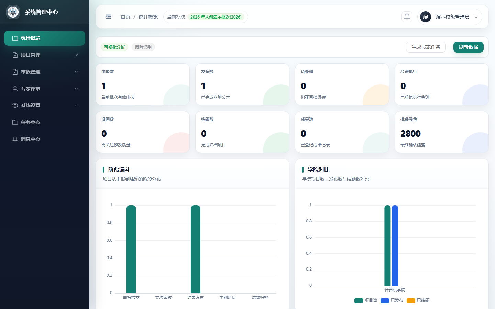
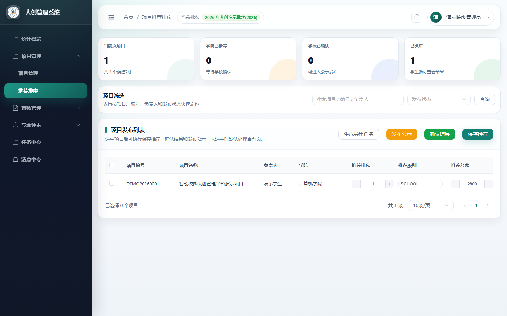
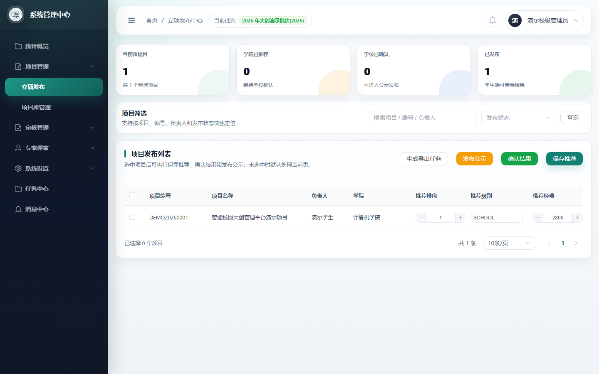
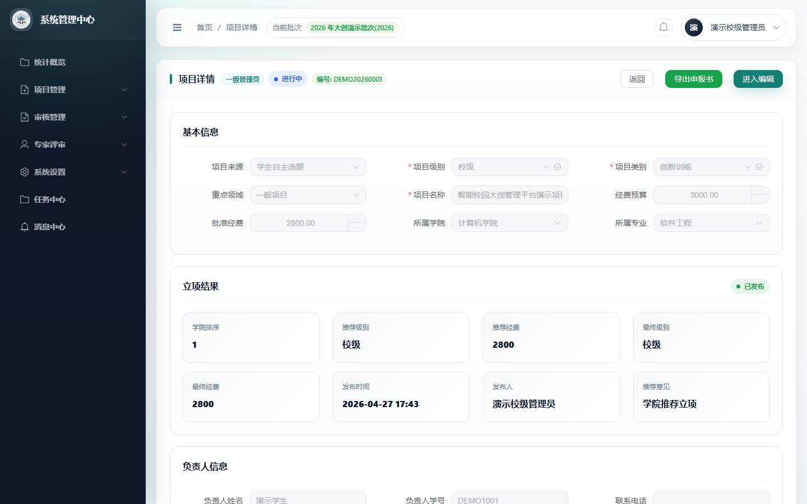
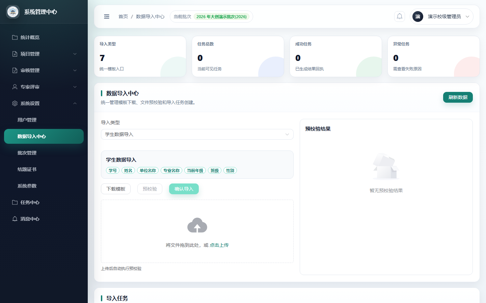
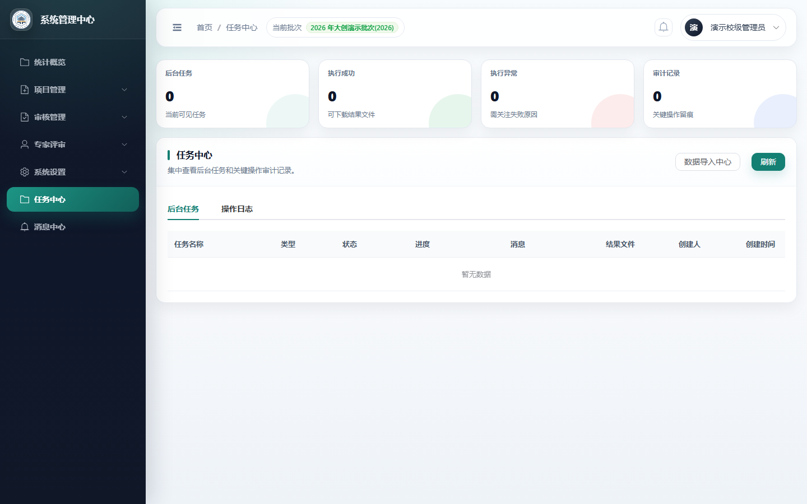
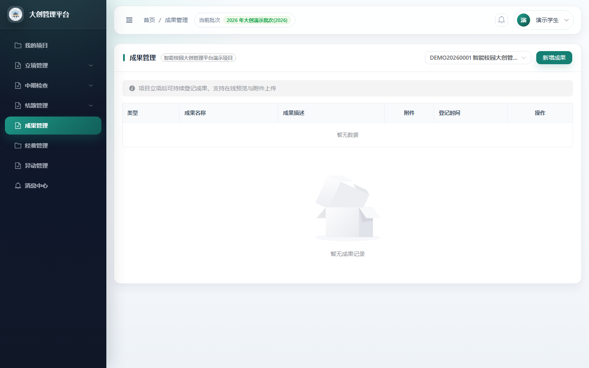
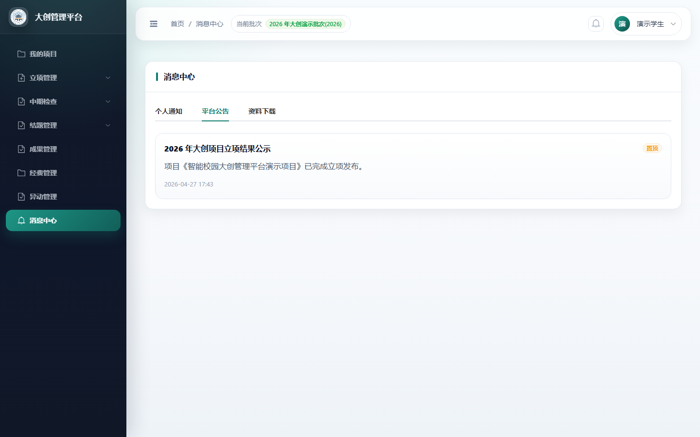
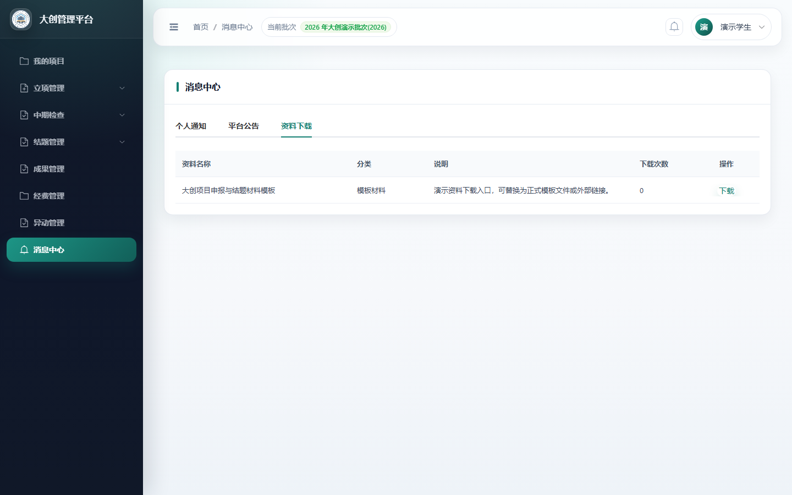

# Dachuang-MS（大创项目管理平台）

Dachuang-MS 是面向大学生创新创业训练项目管理场景的前后端分离系统。系统覆盖项目申报、导师审核、学院推荐、学校立项发布、过程管理、成果登记、数据导入导出、后台任务和统计驾驶舱等核心流程，用于支撑大创项目从申报到归档的全周期管理。

## 技术栈

| 层级 | 技术 |
| --- | --- |
| 后端 | Django, Django REST framework, Simple JWT, Celery |
| 前端 | Vue 3, TypeScript, Vite, Element Plus, Pinia, ECharts |
| 数据库 | PostgreSQL |
| 工程化 | Windows 启动脚本、数据库结构导出脚本、自动截图脚本、后端测试与前端构建检查 |

## 功能模块

- 项目申报：项目基本信息、负责人信息、成员信息、指导教师、申报内容和附件材料管理。
- 审核流程：学生提交、导师审核、学院审核、学校审核、退回修改和流程节点配置。
- 立项发布：学院推荐排序、推荐等级与经费、学校确认、发布结果和公告同步。
- 项目管理：项目列表、详情、流程时间线、状态跟踪、批次管理和历史归档。
- 经费与异动：经费支出申请、分级审批、项目变更申请和终止归档。
- 中期与结题：中期检查、结题申请、成果登记、证书和材料导出。
- 数据中心：模板下载、批量导入、预校验、导出任务和附件打包。
- 任务中心：后台任务、操作日志、导入导出结果和运行状态查看。
- 统计驾驶舱：指标卡、阶段漏斗、学院对比、状态分布和风险视图。
- 系统配置：角色权限、字典项、项目批次、流程节点和业务限制配置。

## 界面预览

截图由脱敏演示数据生成，位于 [`docs/screenshots`](./docs/screenshots/)。

| 页面 | 预览 |
| --- | --- |
| 统计概览 |  |
| 项目推荐排序 |  |
| 立项发布中心 |  |
| 项目详情 |  |
| 数据中心 |  |
| 任务中心 |  |
| 学生端成果管理 |  |
| 学生端通知公告 |  |
| 学生端资料下载 |  |

## 仓库结构

```text
dachuang-ms/
├── backend/                 # Django + DRF 后端
├── frontend/                # Vue 3 + Vite 前端
├── docs/                    # 运行、数据库、演示和截图说明
├── scripts/                 # 数据库导出、开发启动和截图脚本
└── dachuang_db_schema.sql   # 数据库结构文件
```

## 本地运行

Windows 一键启动：

```bat
start-dev.cmd
```

分步运行说明：

- 后端与前端配置：[`docs/SETUP.md`](./docs/SETUP.md)
- Windows 启动脚本：[`docs/SETUP_WINDOWS.md`](./docs/SETUP_WINDOWS.md)
- 数据库结构与导出：[`docs/DB.md`](./docs/DB.md)
- 系统演示与验收：[`docs/DEMO_GUIDE.md`](./docs/DEMO_GUIDE.md)

默认本地地址：

| 服务 | 地址 |
| --- | --- |
| 后端 API | `http://localhost:8000` |
| 前端页面 | `http://localhost:3000` |

## 数据与安全边界

- 仓库只跟踪数据库结构文件 `dachuang_db_schema.sql`。
- 完整数据库导出、上传文件、日志、本地环境变量和本地演示数据不纳入版本控制。
- 公开仓库不包含线上演示地址、登录凭据、真实学院人员信息或真实项目材料。
- 脱敏演示数据由后端管理命令生成，仅用于本地功能验证和截图生成。
- 生产或共享环境必须显式配置强密钥、强数据库密码、允许访问域名和跨域来源。

## 验证命令

后端：

```powershell
cd backend
.\venv\Scripts\python.exe manage.py check
.\venv\Scripts\python.exe manage.py makemigrations --check --dry-run
.\venv\Scripts\python.exe manage.py test
```

前端：

```powershell
cd frontend
npm run type-check
npm run build
```

## 许可证

本项目基于 [MIT License](./LICENSE) 开源。
