# 大学生创新创业管理系统课程设计报告

## 1. 绪论

### 1.1 项目背景

高校大学生创新创业训练计划（大创）项目往往涉及多角色、多阶段、多材料的管理流程，传统线下或分散化表格管理存在信息分散、流转不透明、审批效率低等问题。基于此，建设统一的信息化管理平台，可以将申报、审核、经费、变更与结题等环节纳入同一系统，提升流程规范性与数据可追溯性。

### 1.2 课程设计目标与意义

本课程设计的目标是在真实业务场景下实现一套完整的项目管理系统，覆盖前端界面、后端服务与数据库设计，形成可运行的全栈应用。其意义在于综合训练需求分析、系统设计、数据库建模与实现能力，并通过流程化管理与权限控制提高项目管理的标准化与效率。

### 1.3 技术栈与选型

- 前端：Vue 3 + Vite + TypeScript，配合 Element Plus、Pinia、Vue Router、Axios。
- 后端：Django + Django REST Framework，JWT 认证。
- 数据库：PostgreSQL。

### 1.4 系统概述

系统面向学生、教师（可标记为专家并承担评审任务）、院级管理员与校级管理员等角色，提供项目立项申报、审核评审、中期检查、结题验收、经费管理、项目变更与归档等核心流程，并配套用户管理、字典配置、通知中心与批次管理等基础支撑功能，形成统一的全过程管理平台。

### 1.5 本文结构

本文按照“需求分析—总体设计—数据库设计—界面设计—系统实现—系统测试—部署与运行—总结”的逻辑展开，先明确业务与功能需求，再说明架构与数据模型，随后给出界面设计与关键实现，最后进行测试与部署总结。

## 2. 需求分析

### 2.1 业务流程概述

系统以项目全生命周期为主线，整体流程包括：学生立项申报与材料提交、教师指导审核、管理员审核与专家评审（按阶段配置）、中期检查、经费支出审核、项目变更处理以及结题验收与归档。各阶段通过工作流节点推进，保证流程可追踪、可回溯。

图2-1 总体业务流程（PlantUML，占位）

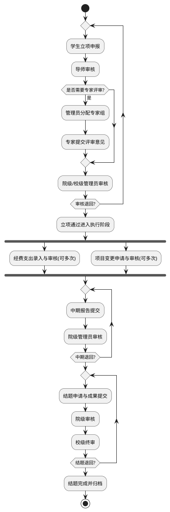

### 2.2 角色与权限分析

系统的权限控制围绕“角色 + 数据范围”展开，不同角色拥有不同功能入口与数据可见范围。总体上，学生面向本人项目操作，教师面向所指导项目；专家评审入口与教师端共用，教师被标记为专家后可承担评审任务；院级管理员面向所属学院范围内的数据，校级管理员拥有全校范围的管理与统计权限。表2-1 给出角色与主要权限概览。

表2-1 角色与权限概览
| 角色 | 主要权限 | 数据范围 |
| --- | --- | --- |
| 学生 | 申报、材料提交、经费录入、变更、结题 | 本人负责或参与项目 |
| 教师/专家 | 导师审核、指导项目查看、专家评审与意见提交 | 指导项目/被分配评审项目 |
| 院级管理员 | 审核、专家组管理、统计与导出 | 本学院范围 |
| 校级管理员 | 终审（立项/结题/经费/异动）、批次与工作流配置、系统基础配置、统计报表 | 全校范围 |

### 2.2.1 学生端

学生端围绕项目生命周期展开，主要功能包括立项申报、成员管理与材料上传；中期检查与结题材料提交；经费支出录入与查看审批结果；项目变更申请与状态跟踪。学生只能访问本人负责或参与的项目，确保数据隔离与隐私安全。

图2-3 学生端用例图（PlantUML，占位）

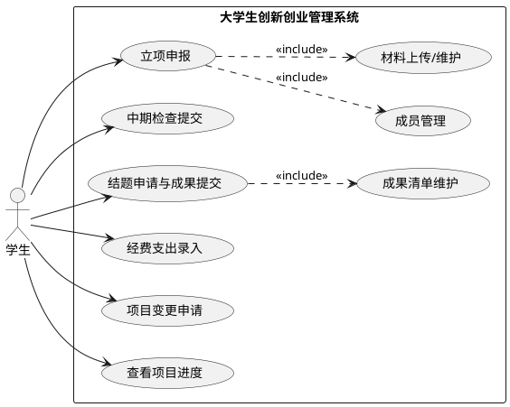

### 2.2.2 教师端与专家评审

教师端提供导师审核、指导项目查看与意见反馈等功能。专家评审入口与教师端共用，管理员在专家库中选择并组建专家组后分配评审任务；系统将教师用户标记为专家（is_expert）后，可在“评审任务”列表填写评审意见并提交。评审结果汇总后进入管理员终审。

图2-4 教师/专家端用例图（PlantUML，占位）

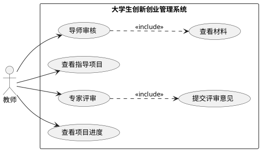

### 2.2.3 院级管理员

院级管理员负责学院范围内的项目审核与专家组管理，分配专家组评审任务，并对本学院项目进行统计与导出。其数据范围受学院字段限制，确保跨学院数据隔离。

图2-5 院级管理员用例图（PlantUML，占位）

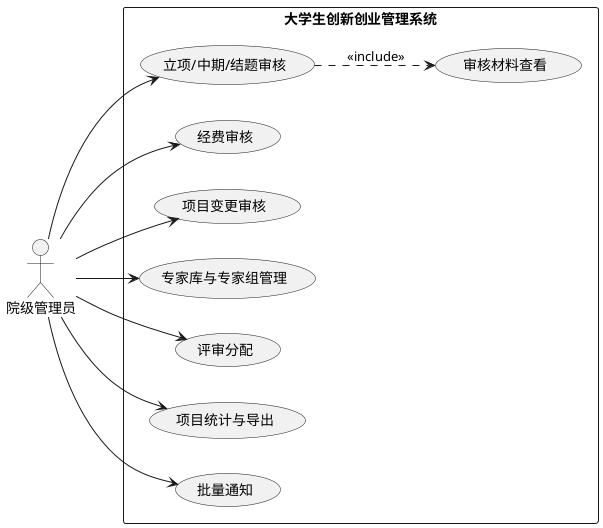

### 2.2.4 校级管理员

校级管理员拥有全校范围的终审权限，主要负责立项、结题、经费与异动的终审把控，同时承担系统基础配置、批次管理与工作流配置，以及全校统计汇总与数据导出。校级管理员通常作为关键阶段的终审节点，保证项目质量与规范性。

图2-6 校级管理员用例图（PlantUML，占位）

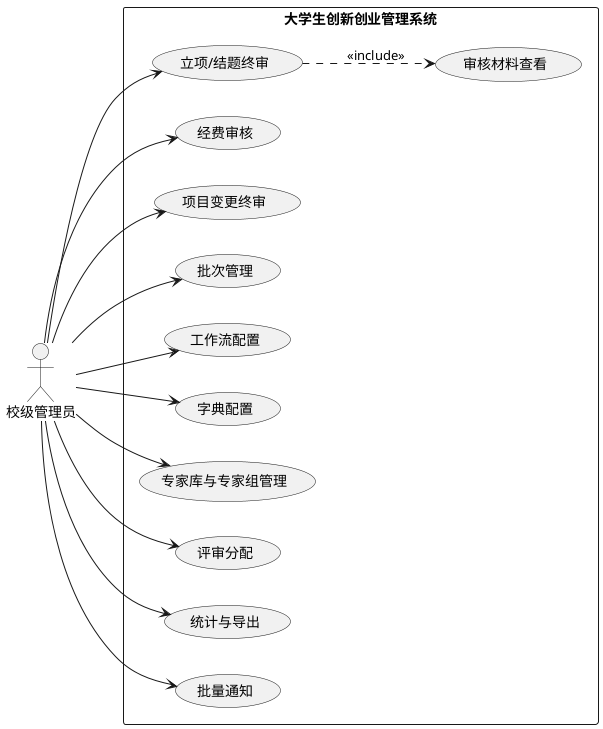

### 2.3 功能需求分析

本系统功能需求围绕“项目业务核心”与“基础支撑管理”两类模块展开。项目业务核心包括立项申报、审核评审、中期检查、结题验收、经费管理与项目变更；基础支撑管理包括用户与角色管理、字典配置、通知中心与批次管理等。

### 2.3.1 立项申报与项目管理

表2-2 立项申报用例描述
| 项目 | 内容 |
| --- | --- |
| 用例编号 | CASE01 |
| 用例名称 | 立项申报 |
| 参与者 | 学生（项目负责人） |
| 前置条件 | 学生已登录；当前批次开放立项申报 |
| 后置条件 | 申报草稿保存或项目提交进入审核 |
| 主要流程 | 1) 学生进入“申请项目”；2) 填写基本信息、成员与指导教师；3) 上传申报材料；4) 保存草稿或提交；5) 系统校验时间窗口并更新状态 |
| 备选流程 | A1：必填项缺失或时间窗口关闭，系统提示并拒绝提交 |

表2-3 项目管理（查询与导出）用例描述
| 项目 | 内容 |
| --- | --- |
| 用例编号 | CASE02 |
| 用例名称 | 项目管理（查询与导出） |
| 参与者 | 院级管理员/校级管理员 |
| 前置条件 | 管理员已登录且具备项目管理权限 |
| 后置条件 | 项目列表与导出结果可用 |
| 主要流程 | 1) 管理员进入“项目管理/项目库”；2) 按批次、学院、状态等条件筛选；3) 查看项目详情；4) 执行导出或附件下载 |
| 备选流程 | A1：筛选结果为空，系统提示空状态 |

### 2.3.2 动态审核与专家评审

表2-4 审核流转与专家评审用例描述
| 项目 | 内容 |
| --- | --- |
| 用例编号 | CASE03 |
| 用例名称 | 审核流转与专家评审 |
| 参与者 | 教师（导师）、专家、院级/校级管理员 |
| 前置条件 | 项目已提交并进入对应审核节点 |
| 后置条件 | 审核意见记录完成，项目状态按节点流转 |
| 主要流程 | 1) 导师审核项目材料并提交意见；2) 若节点启用专家评审，管理员分配专家组；3) 专家提交评审意见；4) 管理员审核并推进流程 |
| 备选流程 | A1：审核驳回，项目退回修改并重新提交；A2：未启用专家评审则跳过专家任务 |

### 2.3.3 中期检查与结题验收

表2-5 中期报告提交用例描述
| 项目 | 内容 |
| --- | --- |
| 用例编号 | CASE04 |
| 用例名称 | 中期报告提交 |
| 参与者 | 学生（项目负责人） |
| 前置条件 | 项目状态为“进行中/中期草稿/中期退回”；处于允许的时间窗口 |
| 后置条件 | 中期提交成功并进入院级管理员审核列表 |
| 主要流程 | 1) 学生进入“中期检查”列表选择项目；2) 上传中期报告并保存草稿或提交；3) 系统校验时间窗口与附件；4) 提交成功，状态更新为“中期已提交” |
| 备选流程 | A1：附件缺失或时间窗口关闭，系统提示并拒绝提交 |

表2-6 结题申请与成果提交用例描述
| 项目 | 内容 |
| --- | --- |
| 用例编号 | CASE05 |
| 用例名称 | 结题申请与成果提交 |
| 参与者 | 学生（项目负责人） |
| 前置条件 | 项目状态为“待结题/结题退回/结题草稿”；处于结题时间窗口 |
| 后置条件 | 结题申请进入院级审核并可被校级终审 |
| 主要流程 | 1) 学生进入“结题管理”选择项目；2) 上传结题报告，维护成果条目；3) 系统校验时间窗口；若配置预期成果清单则按清单校验数量；4) 提交成功进入审核 |
| 备选流程 | A1：材料不完整或校验不通过，系统提示并保持草稿状态 |

### 2.3.4 经费管理与支出审核

表2-7 经费支出录入与审批用例描述
| 项目 | 内容 |
| --- | --- |
| 用例编号 | CASE06 |
| 用例名称 | 经费支出录入与审批 |
| 参与者 | 学生（负责人/成员）、院级/校级管理员 |
| 前置条件 | 项目处于可报销状态；经费余额充足 |
| 后置条件 | 支出记录进入审核并更新通过/驳回状态 |
| 主要流程 | 1) 学生进入“经费管理”并新增支出；2) 填写支出事项、金额、日期并上传凭证；3) 系统校验余额与批次状态；4) 若录入人非负责人，先由负责人预审；5) 管理员审核通过/驳回并记录意见 |
| 备选流程 | A1：金额超出余额，系统提示并拒绝提交 |

### 2.3.5 项目变更与归档

表2-8 项目变更申请与审核用例描述
| 项目 | 内容 |
| --- | --- |
| 用例编号 | CASE07 |
| 用例名称 | 项目变更申请与审核 |
| 参与者 | 学生（负责人）、教师（可选）、院级/校级管理员 |
| 前置条件 | 项目未结题且处于允许变更阶段 |
| 后置条件 | 变更申请通过后写回项目字段并留存审核记录 |
| 主要流程 | 1) 学生进入“异动管理”创建申请；2) 填写变更原因与字段并上传附件；3) 提交后进入审核流；4) 教师/管理员按节点审核；5) 审核通过写回项目信息 |
| 备选流程 | A1：审核驳回，学生收到退回意见并可重新提交 |

### 2.3.6 通知公告与字典配置

表2-9 通知查看与已读用例描述
| 项目 | 内容 |
| --- | --- |
| 用例编号 | CASE08 |
| 用例名称 | 通知查看与已读 |
| 参与者 | 学生/教师/管理员 |
| 前置条件 | 用户已登录 |
| 后置条件 | 通知已读状态更新，未读数量同步减少 |
| 主要流程 | 1) 用户打开通知中心；2) 按类型/状态筛选通知；3) 点击单条标记已读或一键全部已读 |
| 备选流程 | A1：通知列表为空，系统显示空状态提示 |

表2-10 字典条目维护用例描述
| 项目 | 内容 |
| --- | --- |
| 用例编号 | CASE09 |
| 用例名称 | 字典条目维护 |
| 参与者 | 校级管理员 |
| 前置条件 | 管理员已登录并具备系统配置权限 |
| 后置条件 | 字典条目新增/修改/清空生效并影响前端下拉选项 |
| 主要流程 | 1) 管理员进入“系统参数/字典管理”；2) 新增/编辑条目或批量导入；3) 保存后系统更新字典缓存 |
| 备选流程 | A1：条目编码冲突或必填项缺失，系统提示并拒绝保存 |

### 2.4 非功能需求

系统需满足基本性能与可用性要求，保证常见查询与提交操作在可接受的响应时间内完成；在安全性方面，采用基于 JWT 的身份认证与角色权限控制，限制不同角色的数据访问范围；在可维护性方面，后端采用模块化服务与清晰的模型分层，前端按角色路由与页面模块组织，便于后续扩展与迭代。

## 3. 系统总体设计

### 3.1 技术架构与部署拓扑

系统采用“前后端分离 + REST API”的三层架构：前端负责界面展示与交互，后端提供业务逻辑与接口服务，数据库存储业务数据与配置数据。部署上，前端通过 HTTP 调用后端接口，后端与 PostgreSQL 数据库交互。

图3-1 系统架构与部署拓扑（PlantUML，占位）

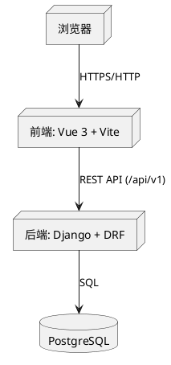

### 3.2 设计原则与约束

系统总体设计遵循以下原则：以流程为主线，保证项目全生命周期可追踪；以角色与数据范围为边界，确保权限控制清晰；以配置驱动流程与字典，减少硬编码并便于调整。约束方面，系统以单数据库为核心存储，时间窗口与批次状态对流程产生限制；部分操作仅校级管理员可执行（如批次与工作流配置），以保证流程一致性与数据安全。

### 3.3 功能模块划分

系统功能分为“项目业务核心模块”和“基础支撑管理模块”。业务核心包括立项申报、审核评审、中期检查、结题验收、经费管理、项目变更与归档；基础支撑包括用户与角色、字典配置、通知中心、批次管理与工作流配置。模块之间通过统一的项目与评审数据模型进行关联。

图3-2 功能架构图（PlantUML，占位）

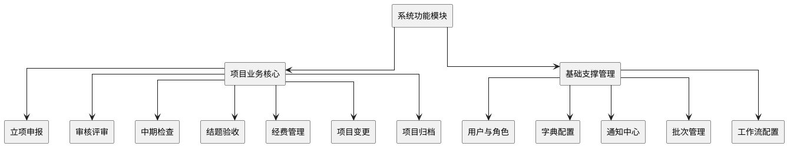

### 3.4 权限模型与数据范围控制

系统权限以“角色 + 数据范围”定义，角色信息存储在 roles 表中，用户通过 role_fk 关联角色；角色 code 用于权限判断，scope_dimension 用于区分校级与院级管理员。院级管理员的数据过滤以用户的 college 字段为准；在工作流节点分派时，系统使用 managed_scope_value（学院字典项）进行管理员解析。数据访问遵循以下原则：学生仅可访问本人负责或参与项目；教师仅可访问指导项目，专家评审任务基于 is_expert 标记在教师端呈现；院级管理员仅访问本学院范围数据；校级管理员可访问全校数据。对于工作流节点的管理员执行人，系统通过 AdminAssignmentService 根据节点角色与项目学院自动解析到具体管理员，保证流程流转与权限一致。

表3-1 权限与数据范围控制要点
| 角色 | 数据范围控制 | 典型限制 |
| --- | --- | --- |
| 学生 | 负责人/成员项目 | 仅本人项目可读写 |
| 教师/专家 | 指导项目/评审任务 | 仅指导或被分配项目可审核 |
| 院级管理员 | 学院范围（college；工作流节点使用 managed_scope_value） | 仅学院项目可管理 |
| 校级管理员 | 全校范围 | 可配置批次与工作流 |

### 3.5 工作流与状态机设计

系统将立项、中期、结题、经费、变更作为不同阶段的工作流（WorkflowConfig），每个工作流由多个节点（WorkflowNode）构成。节点包含节点类型（SUBMIT/REVIEW/APPROVAL）、执行角色（role_fk）、是否需要专家评审（require_expert_review）以及退回规则（return_policy/allowed_reject_to）。项目在每个阶段创建阶段实例（ProjectPhaseInstance），记录当前节点与轮次；当被退回时以新的 attempt_no 重新启动该阶段，确保流程可回溯。

系统工作流按批次与阶段配置，阶段包括立项（APPLICATION）、中期（MID_TERM）、结题（CLOSURE）、经费（BUDGET）与变更（CHANGE）。管理员节点可配置“需要专家评审”，专家评审完成后方可终审，确保评审结果纳入流程决策。

图3-3 阶段轮次与退回机制（PlantUML，占位）

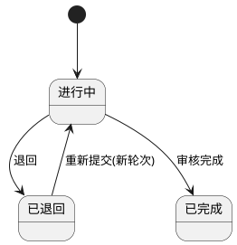

项目状态机围绕全生命周期推进：立项从草稿/提交进入审核，通过后进入“进行中”；中期阶段形成草稿—提交—审核/退回的状态闭环；结题阶段同样包含草稿、审核与退回，并在校级终审通过后进入“已结题”。经费与变更流程在各自阶段内独立推进，不改变主流程方向。

图3-4 项目主流程状态机（简化，PlantUML，占位）

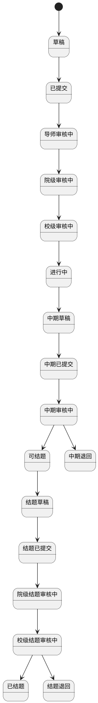

说明：图3-4为主流程简化示意，省略了导师审核通过/驳回与结题二级审核通过/驳回等细分状态。

### 3.6 系统接口与数据流

系统对外提供统一的 REST API 前缀 `/api/v1`，主要接口模块包括：认证与用户（/auth/）、项目管理（/projects/）、审核评审（/reviews/）、通知中心（/notifications/）、数据字典（/dictionaries/）和系统设置（/system-settings/）。前端通过 Axios 统一请求封装访问后端接口，后端按模块路由进行分层处理，并与数据库完成数据读写。

图3-5 前后端接口调用与数据流（PlantUML，占位）

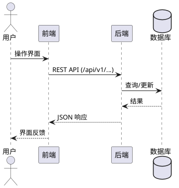

为清晰呈现核心对象关系，类图按业务主题拆分如下。

图3-6 用户与项目核心类图（PlantUML，占位）

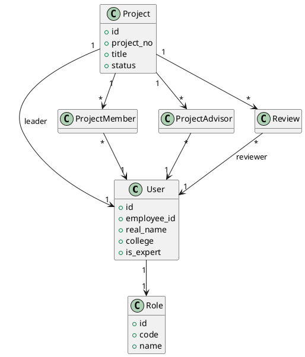

图3-7 批次与工作流类图（PlantUML，占位）

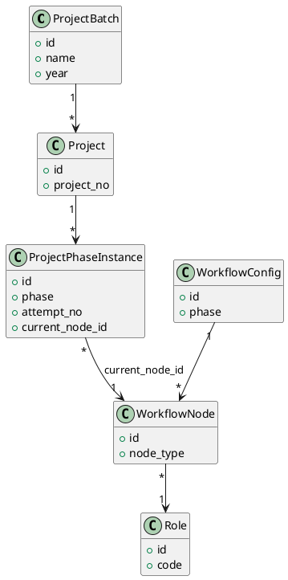

图3-8 字典与通知支撑类图（PlantUML，占位）

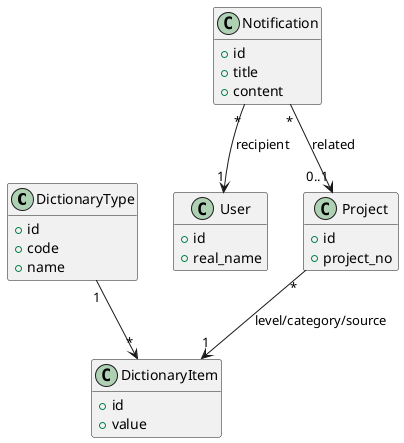

## 4. 数据库设计

### 4.1 概念结构设计（E-R 图）

本系统核心实体包括学生、教师、专家、院级管理员、校级管理员、项目、成员/导师、评审、专家组、经费、变更、成果、批次、字典与通知等，实体之间通过“项目—成员/导师”“项目—评审”“项目—经费支出”“项目—变更申请”“项目—成果”“批次—项目”“字典—业务字段”等关系构成完整的概念模型。

概念模型按业务主题拆分展示，便于在图中突出关键实体、关键属性与核心关联（以下为 E-R 绘图脚本占位，后续可替换为逆向工程或绘图工具导出的图片）。

图4-1 概念模型（项目主体：学生/教师/项目/批次）（E-R 脚本，占位）

```text
F: 学生, 教师, 项目, 项目批次
Y: 学生_学号工号, 学生_姓名, 学生_学院部门_college, 教师_工号, 教师_姓名, 项目_编号, 项目_名称, 项目_状态, 批次_年度
L: 学生_担任项目负责人, 学生_参与项目成员, 教师_指导项目, 项目_隶属批次

Length: 2.2

学生--学生_学号工号
学生--学生_姓名
学生--学生_学院部门_college

教师--教师_工号
教师--教师_姓名

项目--项目_编号
项目--项目_名称
项目--项目_状态

项目批次--批次_年度

学生--学生_担任项目负责人,n
学生_担任项目负责人--项目,1

学生--学生_参与项目成员,n
学生_参与项目成员--项目,n

教师--教师_指导项目,n
教师_指导项目--项目,n

项目--项目_隶属批次,n
项目_隶属批次--项目批次,1
```

图4-2 概念模型（角色分层与数据范围）（E-R 脚本，占位）

```text
F: 教师, 专家, 院级管理员, 校级管理员, 角色, 字典条目
Y: 角色_代码, 角色_名称, 专家_专家级别, 管理员_学院部门_college
L: 教师_具备专家身份, 管理员_分层, 账号归属角色, 管理范围引用字典条目

Length: 2.2

角色--角色_代码
角色--角色_名称

专家--专家_专家级别
院级管理员--管理员_学院部门_college

教师--教师_具备专家身份,1
教师_具备专家身份--专家,1

院级管理员--管理员_分层,1
管理员_分层--校级管理员,1

教师--账号归属角色,1
账号归属角色--角色,n
院级管理员--账号归属角色,1
校级管理员--账号归属角色,1

院级管理员--管理范围引用字典条目,1
管理范围引用字典条目--字典条目,n
```

图4-3 概念模型（流程与评审：阶段实例/节点/审核/专家组）（E-R 脚本，占位）

```text
F: 项目, 项目阶段实例, 工作流节点, 审核记录, 教师, 管理员, 专家组
Y: 阶段实例_阶段, 阶段实例_轮次, 节点_名称, 审核_类型, 审核_状态, 专家组_级别
L: 项目_产生阶段实例, 阶段实例_定位当前节点, 项目_产生审核记录, 审核记录_关联阶段实例, 审核记录_关联工作流节点, 审核记录_审核人, 管理员_创建专家组, 专家组_包含教师成员

Length: 2.3

项目阶段实例--阶段实例_阶段
项目阶段实例--阶段实例_轮次
工作流节点--节点_名称
审核记录--审核_类型
审核记录--审核_状态
专家组--专家组_级别

项目--项目_产生阶段实例,1
项目_产生阶段实例--项目阶段实例,n

项目阶段实例--阶段实例_定位当前节点,n
阶段实例_定位当前节点--工作流节点,1

项目--项目_产生审核记录,1
项目_产生审核记录--审核记录,n

审核记录--审核记录_关联阶段实例,n
审核记录_关联阶段实例--项目阶段实例,1

审核记录--审核记录_关联工作流节点,n
审核记录_关联工作流节点--工作流节点,1

审核记录--审核记录_审核人,1
审核记录_审核人--教师,n

管理员--管理员_创建专家组,1
管理员_创建专家组--专家组,n

专家组--专家组_包含教师成员,1
专家组_包含教师成员--教师,n
```

图4-4 概念模型（业务扩展：成果/经费/变更/归档/通知）（E-R 脚本，占位）

```text
F: 项目, 项目成果, 经费支出, 变更申请, 项目归档, 字典条目, 通知, 学生
Y: 成果_类型, 经费_金额, 经费_状态, 变更_类型, 变更_状态, 归档_归档时间
L: 项目_产生成果, 成果_类别引用字典条目, 项目_产生经费支出, 经费_提交人, 项目_产生变更申请, 变更_提交人, 项目_生成归档, 通知_关联项目

Length: 2.4

项目成果--成果_类型
经费支出--经费_金额
经费支出--经费_状态
变更申请--变更_类型
变更申请--变更_状态
项目归档--归档_归档时间

项目--项目_产生成果,1
项目_产生成果--项目成果,n
项目成果--成果_类别引用字典条目,1
成果_类别引用字典条目--字典条目,n

项目--项目_产生经费支出,1
项目_产生经费支出--经费支出,n
经费支出--经费_提交人,1
经费_提交人--学生,n

项目--项目_产生变更申请,1
项目_产生变更申请--变更申请,n
变更申请--变更_提交人,1
变更_提交人--学生,n

项目--项目_生成归档,1
项目_生成归档--项目归档,1

通知--通知_关联项目,n
通知_关联项目--项目,1
```

### 4.2 逻辑结构设计（关系模型）

数据库采用关系模型组织数据，以下以 SQL 逆向工程图形式展示逻辑结构，并按模块拆分为基础与业务相关子图，便于阅读与维护。

图4-5 用户与字典基础表逻辑结构（SQL 逆向工程图，占位）

```sql
Table "roles" {
  "id" bigint [pk]
  "code" "character varying(50)" [unique]
  "name" "character varying(100)"
}

Table "dictionary_types" {
  "id" bigint [pk]
  "code" "character varying(50)" [unique]
  "name" "character varying(100)"
}

Table "dictionary_items" {
  "id" bigint [pk]
  "dict_type_id" bigint [not null]
  "value" "character varying(50)"
  "label" "character varying(100)"
}

Table "users" {
  "id" bigint [pk]
  "username" "character varying(150)" [unique]
  "employee_id" "character varying(20)" [unique]
  "real_name" "character varying(50)"
  "role_fk_id" bigint
  "managed_scope_value_id" bigint
  "expert_assigned_by_id" bigint
}

/* Refs */
Ref: "dictionary_types"."id" < "dictionary_items"."dict_type_id"
Ref: "roles"."id" < "users"."role_fk_id"
Ref: "dictionary_items"."id" < "users"."managed_scope_value_id"
Ref: "users"."id" < "users"."expert_assigned_by_id"
```

图4-6 项目主体与批次关系结构（SQL 逆向工程图，占位）

```sql
/* Stubs */
Table "users" { "id" bigint [pk] }
Table "dictionary_items" { "id" bigint [pk] }

Table "project_batches" {
  "id" bigint [pk]
  "code" "character varying(50)" [unique]
  "year" integer
  "is_current" boolean
}

Table "projects" {
  "id" bigint [pk]
  "project_no" "character varying(50)" [unique]
  "title" "character varying(200)"
  "status" "character varying(30)"
  "year" integer
  "leader_id" bigint [not null]
  "category_id" bigint
  "level_id" bigint
  "source_id" bigint
  "batch_id" bigint
}

Table "project_members" {
  "id" bigint [pk]
  "project_id" bigint [not null]
  "user_id" bigint [not null]
  "role" "character varying(20)"
}

Table "project_advisors" {
  "id" bigint [pk]
  "project_id" bigint [not null]
  "user_id" bigint [not null]
  "order" integer
}

Table "project_phase_instances" {
  "id" bigint [pk]
  "project_id" bigint [not null]
  "created_by_id" bigint
  "phase" "character varying(20)"
  "attempt_no" integer
  "step" "character varying(50)"
  "state" "character varying(20)"
  "current_node_id" integer
}

Table "project_archives" {
  "id" bigint [pk]
  "project_id" bigint [unique, not null]
  "archived_at" timestamp
}

/* Refs */
Ref: "project_batches"."id" < "projects"."batch_id"
Ref: "users"."id" < "projects"."leader_id"
Ref: "dictionary_items"."id" < "projects"."category_id"
Ref: "dictionary_items"."id" < "projects"."level_id"
Ref: "dictionary_items"."id" < "projects"."source_id"

Ref: "projects"."id" < "project_members"."project_id"
Ref: "users"."id" < "project_members"."user_id"

Ref: "projects"."id" < "project_advisors"."project_id"
Ref: "users"."id" < "project_advisors"."user_id"

Ref: "projects"."id" < "project_phase_instances"."project_id"
Ref: "users"."id" < "project_phase_instances"."created_by_id"

Ref: "projects"."id" < "project_archives"."project_id"
```

图4-7 成果、经费、变更与通知结构（SQL 逆向工程图，占位）

```sql
/* Stubs */
Table "users" { "id" bigint [pk] }
Table "projects" { "id" bigint [pk] }
Table "dictionary_items" { "id" bigint [pk] }

Table "project_achievements" {
  "id" bigint [pk]
  "project_id" bigint [not null]
  "achievement_type_id" bigint [not null]
}

Table "project_expenditures" {
  "id" bigint [pk]
  "project_id" bigint [not null]
  "created_by_id" bigint [not null]
  "reviewed_by_id" bigint
  "amount" numeric(10,2)
  "status" "character varying(20)"
  "expenditure_date" date
}

Table "project_change_requests" {
  "id" bigint [pk]
  "project_id" bigint [not null]
  "created_by_id" bigint [not null]
  "request_type" "character varying(20)"
  "status" "character varying(30)"
}

Table "project_change_reviews" {
  "id" bigint [pk]
  "change_request_id" bigint [not null]
  "reviewer_id" bigint
  "review_level" "character varying(20)"
  "status" "character varying(20)"
}

Table "notifications" {
  "id" bigint [pk]
  "recipient_id" bigint [not null]
  "related_project_id" bigint
  "notification_type" "character varying(20)"
  "is_read" boolean
  "created_at" timestamp
}

/* Refs */
Ref: "projects"."id" < "project_achievements"."project_id"
Ref: "dictionary_items"."id" < "project_achievements"."achievement_type_id"

Ref: "projects"."id" < "project_expenditures"."project_id"
Ref: "users"."id" < "project_expenditures"."created_by_id"
Ref: "users"."id" < "project_expenditures"."reviewed_by_id"

Ref: "projects"."id" < "project_change_requests"."project_id"
Ref: "users"."id" < "project_change_requests"."created_by_id"

Ref: "project_change_requests"."id" < "project_change_reviews"."change_request_id"
Ref: "users"."id" < "project_change_reviews"."reviewer_id"

Ref: "users"."id" < "notifications"."recipient_id"
Ref: "projects"."id" < "notifications"."related_project_id"
```

图4-8 审核评审与专家组结构（SQL 逆向工程图，占位）

```sql
/* Stubs */
Table "users" { "id" bigint [pk] }
Table "projects" { "id" bigint [pk] }
Table "project_phase_instances" { "id" bigint [pk] }
Table "workflow_nodes" { "id" bigint [pk] }

Table "reviews" {
  "id" bigint [pk]
  "project_id" bigint [not null]
  "reviewer_id" bigint
  "phase_instance_id" bigint
  "workflow_node_id" bigint
  "review_type" "character varying(20)"
  "review_level" "character varying(50)"
  "status" "character varying(20)"
  "is_expert_review" boolean
}

Table "expert_groups" {
  "id" bigint [pk]
  "name" "character varying(100)"
  "created_by_id" bigint [not null]
  "scope" "character varying(20)"
}

Table "expert_groups_members" {
  "id" bigint [pk]
  "expertgroup_id" bigint [not null]
  "user_id" bigint [not null]
}

/* Refs */
Ref: "projects"."id" < "reviews"."project_id"
Ref: "users"."id" < "reviews"."reviewer_id"
Ref: "project_phase_instances"."id" < "reviews"."phase_instance_id"
Ref: "workflow_nodes"."id" < "reviews"."workflow_node_id"

Ref: "users"."id" < "expert_groups"."created_by_id"
Ref: "expert_groups"."id" < "expert_groups_members"."expertgroup_id"
Ref: "users"."id" < "expert_groups_members"."user_id"
```

图4-9 工作流与系统配置结构（SQL 逆向工程图，占位）

```sql
/* Stubs */
Table "users" { "id" bigint [pk] }
Table "roles" { "id" bigint [pk] }
Table "dictionary_items" { "id" bigint [pk] }

Table "project_batches" {
  "id" bigint [pk]
  "code" "character varying(50)" [unique]
  "year" integer
  "is_current" boolean
}

Table "workflow_configs" {
  "id" bigint [pk]
  "batch_id" bigint
  "phase" "character varying(20)"
  "version" integer
  "is_active" boolean
  "is_locked" boolean
  "created_by_id" bigint
  "updated_by_id" bigint
}

Table "workflow_nodes" {
  "id" bigint [pk]
  "workflow_id" bigint [not null]
  "code" "character varying(50)"
  "name" "character varying(100)"
  "review_level" "character varying(20)"
  "role_fk_id" bigint
  "require_expert_review" boolean
  "allowed_reject_to" integer
}

Table "system_settings" {
  "id" bigint [pk]
  "code" "character varying(50)"
  "batch_id" bigint
  "updated_by_id" bigint
  "is_active" boolean
  "is_locked" boolean
}

Table "certificate_settings" {
  "id" bigint [pk]
  "template_code" "character varying(50)"
  "project_category_id" bigint
  "project_level_id" bigint
  "updated_by_id" bigint
  "is_active" boolean
}

/* Refs */
Ref: "project_batches"."id" < "workflow_configs"."batch_id"
Ref: "users"."id" < "workflow_configs"."created_by_id"
Ref: "users"."id" < "workflow_configs"."updated_by_id"

Ref: "workflow_configs"."id" < "workflow_nodes"."workflow_id"
Ref: "roles"."id" < "workflow_nodes"."role_fk_id"

Ref: "project_batches"."id" < "system_settings"."batch_id"
Ref: "users"."id" < "system_settings"."updated_by_id"

Ref: "dictionary_items"."id" < "certificate_settings"."project_category_id"
Ref: "dictionary_items"."id" < "certificate_settings"."project_level_id"
Ref: "users"."id" < "certificate_settings"."updated_by_id"
```

### 4.3 核心数据表设计

### 4.3.1 用户与角色（users、roles）

表4-1 角色表（roles）
| 字段 | 类型 | 说明 |
| --- | --- | --- |
| id | bigint | 主键 |
| code | varchar(50) | 角色代码（STUDENT/TEACHER/LEVEL1_ADMIN 等） |
| name | varchar(100) | 角色名称 |
| scope_dimension | varchar(50) | 数据范围维度（COLLEGE/SCHOOL） |

表4-2 用户表（users）
| 字段 | 类型 | 说明 |
| --- | --- | --- |
| id | bigint | 主键 |
| employee_id | varchar(20) | 学号/工号 |
| real_name | varchar(50) | 姓名 |
| role_fk_id | bigint | 角色外键（roles.id） |
| is_expert | boolean | 是否专家 |
| expert_scope | varchar(20) | 专家级别（SCHOOL/COLLEGE） |
| managed_scope_value_id | bigint | 管理范围字典项 |
| college | varchar(100) | 学院/部门（college） |
| title | varchar(50) | 职称 |
| phone | varchar(11) | 手机号 |
| email | varchar(254) | 邮箱 |
| major | varchar(100) | 专业 |
| grade | varchar(10) | 年级 |
| class_name | varchar(50) | 班级 |
| gender | varchar(10) | 性别 |

### 4.3.2 项目与成员（projects、project_members、project_advisors）

表4-3 项目表（projects）
| 字段 | 类型 | 说明 |
| --- | --- | --- |
| id | bigint | 主键 |
| project_no | varchar(50) | 项目编号 |
| batch_id | bigint | 项目批次（project_batches.id） |
| year | integer | 项目年份 |
| title | varchar(200) | 项目名称 |
| description | text | 项目简介 |
| level_id | bigint | 项目级别（字典项） |
| category_id | bigint | 项目类别（字典项） |
| source_id | bigint | 项目来源（字典项） |
| leader_id | bigint | 项目负责人（users.id） |
| status | varchar(30) | 项目状态 |
| budget | numeric(10,2) | 项目经费 |
| approved_budget | numeric(10,2) | 批准经费 |
| expected_results | text | 预期成果描述 |
| expected_results_data | jsonb | 预期成果清单 |
| proposal_file | varchar(255) | 申报书文件 |
| mid_term_report | varchar(255) | 中期报告 |
| final_report | varchar(255) | 结题报告 |
| achievement_file | varchar(255) | 成果附件 |

表4-4 项目成员表（project_members）
| 字段 | 类型 | 说明 |
| --- | --- | --- |
| id | bigint | 主键 |
| project_id | bigint | 项目外键 |
| user_id | bigint | 成员用户 |
| role | varchar(20) | 成员角色（负责人/成员） |

表4-5 项目指导教师表（project_advisors）
| 字段 | 类型 | 说明 |
| --- | --- | --- |
| id | bigint | 主键 |
| project_id | bigint | 项目外键 |
| user_id | bigint | 指导教师 |

### 4.3.3 评审与专家（reviews、expert_groups）

表4-6 评审记录表（reviews）
| 字段 | 类型 | 说明 |
| --- | --- | --- |
| id | bigint | 主键 |
| project_id | bigint | 项目外键 |
| phase_instance_id | bigint | 关联阶段轮次 |
| workflow_node_id | bigint | 关联工作流节点 |
| review_type | varchar(20) | 审核类型（APPLICATION/MID_TERM/CLOSURE） |
| reviewer_id | bigint | 审核人 |
| is_expert_review | boolean | 是否专家评审任务 |
| status | varchar(20) | 审核状态（PENDING/APPROVED/REJECTED） |
| comments | text | 审核意见 |

表4-7 专家组表（expert_groups）
| 字段 | 类型 | 说明 |
| --- | --- | --- |
| id | bigint | 主键 |
| name | varchar(100) | 专家组名称 |
| scope | varchar(20) | 专家组级别（COLLEGE/SCHOOL） |
| created_by_id | bigint | 创建人 |

表4-8 专家组成员表（reviews_expertgroup_members）
| 字段 | 类型 | 说明 |
| --- | --- | --- |
| id | bigint | 主键 |
| expertgroup_id | bigint | 专家组外键 |
| user_id | bigint | 成员用户 |

### 4.3.4 批次与流程（project_batches、workflow_configs、workflow_nodes）

表4-9 项目批次表（project_batches）
| 字段 | 类型 | 说明 |
| --- | --- | --- |
| id | bigint | 主键 |
| name | varchar(100) | 批次名称 |
| year | integer | 年度 |
| status | varchar(20) | 批次状态（draft/active/finished/archived） |

表4-10 流程配置表（workflow_configs）
| 字段 | 类型 | 说明 |
| --- | --- | --- |
| id | bigint | 主键 |
| name | varchar(100) | 流程名称 |
| phase | varchar(20) | 流程阶段（APPLICATION/MID_TERM/CLOSURE/BUDGET/CHANGE） |
| batch_id | bigint | 所属批次 |
| version | integer | 版本号 |

表4-11 流程节点表（workflow_nodes）
| 字段 | 类型 | 说明 |
| --- | --- | --- |
| id | bigint | 主键 |
| workflow_id | bigint | 关联流程配置 |
| code | varchar(50) | 节点编码 |
| name | varchar(100) | 节点名称 |
| node_type | varchar(20) | 节点类型（SUBMIT/REVIEW/APPROVAL） |
| role_fk_id | bigint | 执行角色 |
| require_expert_review | boolean | 是否需要专家评审 |
| return_policy | varchar(20) | 退回规则（NONE/STUDENT/TEACHER/PREVIOUS） |
| allowed_reject_to | integer | 允许退回的节点ID |
| sort_order | integer | 排序 |

### 4.3.5 字典与通知（dictionary_types、dictionary_items、notifications）

表4-12 字典类型表（dictionary_types）
| 字段 | 类型 | 说明 |
| --- | --- | --- |
| id | bigint | 主键 |
| code | varchar(50) | 字典类型编码 |
| name | varchar(100) | 字典类型名称 |

表4-13 字典条目表（dictionary_items）
| 字段 | 类型 | 说明 |
| --- | --- | --- |
| id | bigint | 主键 |
| dict_type_id | bigint | 关联字典类型 |
| value | varchar(50) | 选项值 |
| label | varchar(100) | 显示名称 |
| sort_order | integer | 排序 |
| extra_data | jsonb | 扩展数据 |
| template_file | varchar(255) | 模板文件 |

表4-14 通知表（notifications）
| 字段 | 类型 | 说明 |
| --- | --- | --- |
| id | bigint | 主键 |
| title | varchar(200) | 通知标题 |
| content | text | 通知内容 |
| notification_type | varchar(20) | 通知类型（SYSTEM/PROJECT/REVIEW） |
| recipient_id | bigint | 接收人 |
| related_project_id | bigint | 关联项目 |
| is_read | boolean | 是否已读 |
| created_at | timestamp | 创建时间 |

### 4.4 约束与索引设计

数据库约束用于保证业务唯一性与关系一致性，索引用于提升常见筛选与待办查询性能。表4-15 汇总主要唯一约束与索引设计。

表4-15 主要唯一约束与索引
| 类型 | 表 | 字段/说明 |
| --- | --- | --- |
| UNIQUE | projects | project_no（项目编号唯一） |
| UNIQUE | users | employee_id（学号/工号唯一） |
| UNIQUE | roles | code（角色代码唯一） |
| UNIQUE | project_members | project_id + user_id（成员唯一） |
| UNIQUE | project_phase_instances | project_id + phase + attempt_no（阶段轮次唯一） |
| UNIQUE | dictionary_types | code（字典类型编码唯一） |
| UNIQUE | dictionary_items | dict_type_id + value（字典条目唯一） |
| UNIQUE | workflow_configs | phase + batch_id + version（流程版本唯一） |
| UNIQUE | workflow_nodes | workflow_id + code（节点编码唯一） |
| INDEX | projects | project_no、status（按编号/状态检索） |
| INDEX | reviews | project_id + workflow_node_id、status（待审核查询） |
| INDEX | project_expenditures | project_id + expenditure_date、status（经费统计与查询） |
| INDEX | notifications | recipient_id + is_read（通知中心筛选） |
| INDEX | project_achievements | project_id + achievement_type（成果分类统计） |
| INDEX | project_archives | archived_at（归档时间排序） |

## 5. 界面设计

### 5.1 系统布局与路由组织

系统采用“左侧导航 + 顶部栏 + 主内容区”的统一布局，菜单按角色动态加载，登录后进入对应角色工作台。

图5-1 系统主布局（侧边栏 + 顶部栏 + 面包屑 + 当前批次标签）（截图占位）
图5-2 登录页面（截图占位）

### 5.2 学生端功能界面

学生端以立项、中期、结题、经费与异动为主线，以下截图展示主要页面与表单入口。

图5-3 学生端“我的项目”列表与筛选（截图占位）
图5-4 学生端“申请项目”表单（截图占位）
图5-5 学生端“中期检查”列表（截图占位）
图5-6 学生端“中期报告提交”页面（截图占位）
图5-7 学生端“经费管理”详情页（截图占位）
图5-8 学生端“异动申请”页面（截图占位）
图5-9 学生端“待结题项目”列表（截图占位）
图5-10 学生端“结题申请”页面（截图占位）
图5-11 学生端“已申请结题”列表（截图占位）

此外，学生端提供“历史项目”页面，用于查询已归档项目与历史批次信息。

### 5.3 教师/专家端功能界面

教师/专家端以看板与审核弹窗为核心，截图展示待审核/评审入口、材料查看与意见提交。

图5-12 教师端“待审核/我指导的项目”看板（截图占位）
图5-13 教师端审核弹窗（包含审核意见与材料下载）（截图占位）
图5-14 专家端“评审任务”列表（截图占位）

### 5.4 管理端功能界面

管理端按校级/院级管理员分层展示统计、项目库、审核与专家管理等界面，系统配置仅校级管理员可见，以下截图呈现关键页面入口。

图5-15 管理端“统计概览”页面（截图占位）
图5-16 管理端“用户管理/专家库”页面（截图占位）
图5-17 管理端“项目管理/项目库”列表（截图占位）
图5-18 管理端“立项审核/结题审核”列表与审核操作（截图占位）
图5-19 管理端“专家组管理/评审分配”页面（截图占位）
图5-20 管理端“批次管理”页面（截图占位）
图5-21 管理端“批次配置/工作流配置”页面（截图占位）
图5-22 管理端“系统参数/字典管理”页面（截图占位）

## 6. 系统实现

### 6.1 后端实现（Django + DRF）

#### 6.1.1 认证授权与 JWT

系统采用基于学号/工号与密码的登录方式，通过 JWT 返回访问令牌与刷新令牌，并在响应中携带用户与角色信息。登录接口在 `AuthViewSet.login` 中完成校验与返回；核心令牌生成逻辑由 `AuthService.handle_login` 负责，使用 `RefreshToken.for_user` 生成令牌。受保护接口（如 `profile`）使用 `IsAuthenticated` 进行鉴权。

代码示例（后端认证流程）：

```python
# backend/apps/users/views/public/auth.py
class AuthViewSet(viewsets.GenericViewSet):
    permission_classes = [AllowAny]
    serializer_class = LoginSerializer

    @action(methods=["post"], detail=False)
    def login(self, request):
        serializer = self.get_serializer(data=request.data)
        serializer.is_valid(raise_exception=True)
        user = serializer.validated_data["user"]
        token_data = self.auth_service.handle_login(
            user=user,
            ip_address=self._get_client_ip(request),
            user_agent=request.META.get("HTTP_USER_AGENT", ""),
        )
        return Response(token_data, status=status.HTTP_200_OK)

    @action(methods=["get"], detail=False, permission_classes=[IsAuthenticated])
    def profile(self, request):
        user_data = self.user_service.get_user_profile(request.user)
        return Response({"code": 200, "message": "获取成功", "data": user_data})
```

```python
# backend/apps/users/services/auth_service.py
class AuthService:
    def handle_login(self, user, ip_address, user_agent):
        refresh = RefreshToken.for_user(user)
        user_data = self.user_repository.get_user_data(user)
        return {
            "code": 200,
            "message": "登录成功",
            "data": {
                "refresh_token": str(refresh),
                "access_token": str(refresh.access_token),
                "user": user_data,
            },
        }
```

#### 6.1.2 项目申报与流程流转

立项申报采用“草稿保存/正式提交”两种模式，后端在 `ProjectApplicationService` 内完成数据校验、指导教师/成员写入、项目编号生成与状态更新。提交后系统创建立项阶段实例并触发审核任务（ReviewService.start_phase_review），形成从“提交”到“审核”的流程流转。

代码示例（申报保存与提交）：

```python
# backend/apps/projects/services/application_service.py
class ProjectApplicationService:
    @staticmethod
    def create_application(request):
        data = request.data.copy()
        is_draft = _to_bool(data.get("is_draft", True))
        data["leader"] = request.user.id
        data["status"] = Project.ProjectStatus.DRAFT if is_draft else Project.ProjectStatus.SUBMITTED

        # 限额与时间窗口校验（非草稿才校验）
        if not is_draft:
            ok, msg = _check_application_window(_get_current_batch())
            if not ok:
                return {"code": 400, "message": msg}, status.HTTP_400_BAD_REQUEST

        project = ProjectSerializer(data=data, context={"request": request, "is_draft": is_draft}).save()
        if not is_draft:
            project.submitted_at = timezone.now()
            project.project_no = _generate_project_no(project.year or timezone.now().year, request.user.college)
            project.save()
            ReviewService.start_phase_review(project, ProjectPhaseInstance.Phase.APPLICATION, created_by=request.user)

        return {"code": 201, "message": "保存成功" if is_draft else "提交成功"}, status.HTTP_201_CREATED
```

#### 6.1.3 专家组与评审任务分配

系统提供“专家组管理 + 评审分配”两部分能力。后端通过 `ExpertGroupViewSet` 限制创建与修改权限，并在 `ReviewService.assign_project_to_group` 中校验专家组成员合法性、学院范围与“指导教师不能评审本项目”等规则，最终生成专家评审记录并发送通知。

代码示例（专家组与批量分配）：

```python
# backend/apps/reviews/views/expert_groups.py
class ExpertGroupViewSet(viewsets.ModelViewSet):
    queryset = ExpertGroup.objects.all()
    serializer_class = ExpertGroupSerializer
    permission_classes = [ExpertGroupPermission]

    def perform_create(self, serializer):
        user = self.request.user
        scope = "SCHOOL" if user.is_level1_admin else "COLLEGE"
        serializer.save(created_by=user, scope=scope)
```

```python
# backend/apps/reviews/views/assignments.py
class ReviewAssignmentViewSet(viewsets.ViewSet):
    @action(detail=False, methods=["post"])
    def assign_batch(self, request):
        created = ReviewService.assign_project_to_group(
            project_ids=request.data.get("project_ids", []),
            group_id=request.data.get("group_id"),
            review_type=request.data.get("review_type", Review.ReviewType.APPLICATION),
            creator=request.user,
            target_node_id=request.data.get("target_node_id"),
        )
        return Response({"message": f"Successfully assigned {len(created)} review tasks."})
```

#### 6.1.4 经费支出与审批流程

经费模块支持“支出录入—负责人预审—工作流节点审核”的流程。后端 `ProjectExpenditureViewSet.create` 完成批次校验、权限校验与余额校验；若录入人不是负责人，先进入负责人预审，预审通过后启动经费工作流节点审核。

代码示例（经费录入与审核接口）：

```python
# backend/apps/projects/views/public/expenditure.py
class ProjectExpenditureViewSet(viewsets.ModelViewSet):
    def create(self, request, *args, **kwargs):
        serializer = self.get_serializer(data=request.data)
        serializer.is_valid(raise_exception=True)
        project = serializer.validated_data["project"]
        amount = serializer.validated_data["amount"]

        current_batch = SystemSettingService.get_current_batch()
        if not current_batch or project.batch_id != current_batch.id:
            raise serializers.ValidationError("当前批次不允许操作该项目经费")

        if not self._can_manage_expenditure(request.user, project):
            raise PermissionDenied("无权限录入该项目经费")

        stats = ProjectService.get_budget_stats(project)
        if amount > stats["remaining_amount"]:
            raise serializers.ValidationError("余额不足")

        expenditure = ProjectExpenditure.objects.create(
            project=project,
            title=serializer.validated_data["title"],
            amount=amount,
            expenditure_date=serializer.validated_data["expenditure_date"],
            proof_file=serializer.validated_data.get("proof_file"),
            status=ProjectExpenditure.ExpenditureStatus.PENDING,
            created_by=request.user,
            leader_review_status=ProjectExpenditure.LeaderReviewStatus.PENDING
            if project.leader_id != request.user.id
            else ProjectExpenditure.LeaderReviewStatus.SKIPPED,
        )
        if expenditure.leader_review_status == ProjectExpenditure.LeaderReviewStatus.SKIPPED:
            ExpenditureWorkflowService.start_workflow(expenditure)
        return Response(self.get_serializer(expenditure).data, status=status.HTTP_201_CREATED)
```

#### 6.1.5 项目变更、成果与归档

项目变更由 `ProjectChangeRequestViewSet` 受理，提交时校验负责人身份与项目状态（已结题或终止禁止变更），随后进入工作流节点审核并回传审核结果。

代码示例（变更申请提交校验）：

```python
# backend/apps/projects/views/public/changes.py
@action(methods=["post"], detail=True)
def submit(self, request, pk=None):
    change_request = self.get_object()
    if change_request.created_by != request.user:
        return Response(
            {"code": 403, "message": "无权限提交"},
            status=status.HTTP_403_FORBIDDEN,
        )
    if change_request.status != ProjectChangeRequest.ChangeStatus.DRAFT:
        return Response(
            {"code": 400, "message": "当前状态不允许提交"},
            status=status.HTTP_400_BAD_REQUEST,
        )
    ProjectChangeService.submit_request(change_request)
    return Response({"code": 200, "message": "提交成功"})
```

成果管理用于持续登记项目产出，后端限制仅在项目进行中或结题阶段（草稿/已提交）允许新增与删除成果，避免与结题材料不一致。

代码示例（成果新增限制）：

```python
# backend/apps/projects/views/mixins/project_achievements_mixin.py
@action(methods=["post"], detail=True, url_path="add-achievement")
def add_achievement(self, request, pk=None):
    project = self.get_object()
    if project.leader != request.user:
        return Response(
            {"code": 403, "message": "只有项目负责人可以添加成果"},
            status=status.HTTP_403_FORBIDDEN,
        )

    allowed_statuses = [
        Project.ProjectStatus.IN_PROGRESS,
        Project.ProjectStatus.CLOSURE_DRAFT,
        Project.ProjectStatus.CLOSURE_SUBMITTED,
    ]
    if project.status not in allowed_statuses:
        return Response(
            {"code": 400, "message": "当前项目状态不允许添加成果"},
            status=status.HTTP_400_BAD_REQUEST,
        )

    serializer = ProjectAchievementSerializer(data=request.data)
    serializer.is_valid(raise_exception=True)
    serializer.save(project=project)
    return Response({"code": 200, "message": "成果添加成功", "data": serializer.data})
```

归档采用“批次归档 + 历史项目”模式：归档后生成 `ProjectArchive` 记录，并在项目查询中通过 `history_batch_id` 与 `include_archived` 控制是否返回归档数据。

代码示例（归档记录创建）：

```python
# backend/apps/projects/services/archive_service.py
@transaction.atomic
def archive_project(project, request=None, archived_by=None):
    snapshot = ArchiveService.build_archive_snapshot(project, request=request)
    attachments = ArchiveService.build_archive_attachments(project)
    archive = ProjectArchive.objects.create(
        project=project,
        snapshot=snapshot,
        attachments=attachments,
        metadata={"archived_by": archived_by.username if archived_by else "system"},
    )
    return archive
```

代码示例（历史项目查询过滤）：

```python
# backend/apps/projects/views/public/project.py
include_archived = self.request.query_params.get("include_archived")
history_batch_id = self.request.query_params.get("history_batch_id")

if history_batch_id:
    batch = ProjectBatch.objects.filter(
        id=history_batch_id,
        status=ProjectBatch.STATUS_ARCHIVED,
        is_deleted=False,
    ).first()
    queryset = queryset.filter(batch=batch)
elif include_archived and str(include_archived).lower() in ("true", "1", "yes"):
    queryset = queryset.filter(batch__is_deleted=False)
else:
    current_batch = SystemSettingService.get_current_batch()
    queryset = queryset.filter(batch=current_batch, batch__is_deleted=False)
```

#### 6.1.6 通知公告与字典配置

通知模块以 `NotificationViewSet` 提供只读查询与状态操作，支持已读标记与未读统计。

代码示例（通知全部已读）：

```python
# backend/apps/notifications/views/__init__.py
@action(methods=["post"], detail=False, url_path="mark-all-read")
def mark_all_read(self, request):
    Notification.objects.filter(recipient=request.user, is_read=False).update(
        is_read=True, read_at=timezone.now()
    )
    return Response({"code": 200, "message": "已标记所有通知为已读"})
```

数据字典采用“字典类型 + 字典条目”模型，支持按编码获取字典，便于前端初始化缓存。

代码示例（按编码获取字典）：

```python
# backend/apps/dictionaries/views/__init__.py
@action(detail=False, methods=["get"], url_path="by-code/(?P<code>[^/.]+)")
def by_code(self, request, code=None):
    dict_type = DictionaryType.objects.prefetch_related("items").get(
        code=code, is_active=True
    )
    items = dict_type.items.filter(is_active=True).order_by("sort_order", "id")
    serializer = DictionaryItemSimpleSerializer(items, many=True)
    return Response({"code": dict_type.code, "name": dict_type.name, "items": serializer.data})
```

#### 6.1.7 批次管理与工作流配置

批次管理由 `ProjectBatchViewSet` 负责，`set_current` 保证同一时间仅有一个进行中批次。

代码示例（设置当前批次）：

```python
# backend/apps/system_settings/views/__init__.py
@action(detail=True, methods=["post"], url_path="set-current")
def set_current(self, request, pk=None):
    batch = self.get_object()
    ProjectBatch.objects.exclude(id=batch.id).update(is_current=False)
    batch.is_current = True
    batch.is_active = True
    batch.status = ProjectBatch.STATUS_ACTIVE
    batch.save(update_fields=["is_current", "is_active", "status"])
    serializer = self.get_serializer(batch)
    return Response({"code": 200, "message": "设置成功", "data": serializer.data})
```

工作流配置由 `BatchWorkflowViewSet` 管理，支持初始化默认流程与节点。

代码示例（初始化批次工作流）：

```python
# backend/apps/system_settings/views/batch_workflow.py
@action(detail=True, methods=["post"], url_path="workflows/(?P<phase>[^/.]+)/init")
@transaction.atomic
def init_workflow(self, request, pk=None, phase=None):
    batch = get_object_or_404(ProjectBatch, pk=pk)
    workflow = WorkflowConfig.objects.create(
        name=f"{batch.name}-{phase}工作流",
        phase=phase,
        batch=batch,
        version=1,
        is_active=True,
        created_by=request.user,
        updated_by=request.user,
    )
    serializer = WorkflowConfigSerializer(workflow)
    return Response(serializer.data, status=status.HTTP_201_CREATED)
```

### 6.2 前端实现（Vue 3）

#### 6.2.1 请求封装与鉴权

请求层统一拼接 `/api/v1` 前缀并在请求头携带 token，同时集中处理异常提示与未登录跳转。

代码示例（请求封装与鉴权）：

```ts
// frontend/src/utils/request.ts
const request = axios.create({
  baseURL: `${CONFIG.api.BASE_URL}/api/${CONFIG.api.API_VERSION}`,
  timeout: CONFIG.api.TIMEOUT,
});

request.interceptors.request.use((config) => {
  const token = localStorage.getItem(CONFIG.app.STORAGE_KEYS.TOKEN);
  if (token) {
    config.headers.Authorization = `Bearer ${token}`;
  }
  return config;
});

request.interceptors.response.use(
  (response) => response.data,
  async (error) => {
    if (error.response?.status === 401) {
      localStorage.removeItem(CONFIG.app.STORAGE_KEYS.TOKEN);
      window.location.replace("/login");
    }
    return Promise.reject(error);
  },
);
```

#### 6.2.2 路由与权限控制

路由元信息标注角色与鉴权要求，路由守卫在登录后根据角色与 `scope_dimension` 进行跳转与拦截。

代码示例（路由守卫与角色校验）：

```ts
// frontend/src/router/index.ts
router.beforeEach(async (to, _from, next) => {
  const userStore = useUserStore();
  const userRole = localStorage.getItem("user_role");

  if (to.meta.requiresAuth !== false && !userStore.isLoggedIn) {
    next({ name: "login" });
    return;
  }

  const routeRole = to.meta.role as string | undefined;
  if (routeRole && routeRole !== userRole) {
    if (routeRole === "level2_admin" && userStore.roleInfo?.scope_dimension) {
      next();
      return;
    }
    next({ name: "login" });
    return;
  }
  next();
});
```

#### 6.2.3 状态管理与用户信息

使用 Pinia 管理登录态与角色信息，统一持久化 token 与 role_info，并提供拉取个人信息与登出能力。

```ts
// frontend/src/stores/user.ts
const token = ref<string>(localStorage.getItem("token") || "");
const roleInfo = ref(storedRoleInfo ? JSON.parse(storedRoleInfo) : null);

async function loginAction(employeeId: string, password: string) {
  const response = await login(employeeId, password);
  if (response.code === 200 && response.data) {
    token.value = response.data.access_token;
    localStorage.setItem("token", response.data.access_token);
    if (response.data.user?.role_info) {
      localStorage.setItem(
        "role_info",
        JSON.stringify(response.data.user.role_info),
      );
    }
  }
}
```

#### 6.2.4 字典缓存与表单校验

通过 `useDictionary` 缓存字典选项，保证下拉项与后端配置同步；表单规则在页面中复用统一校验逻辑。

代码示例（字典缓存与选项获取）：

```ts
// frontend/src/composables/useDictionary.ts
const dictionaryCache = ref<DictionaryBatchResponse>({});

const getOptions = (code: string): DictionaryItem[] => {
  return dictionaryCache.value[code]?.items || [];
};

const loadDictionaries = async (codes: Array<string | null | undefined>) => {
  const cleanedCodes = Array.from(new Set(codes))
    .filter((code): code is string => typeof code === "string")
    .map((code) => code.trim())
    .filter(Boolean);
  if (cleanedCodes.length === 0) return;

  const missingCodes = cleanedCodes.filter(
    (code) => !dictionaryCache.value[code],
  );
  if (missingCodes.length === 0) return;

  const data = await getDictionariesBatch(missingCodes);
  dictionaryCache.value = { ...dictionaryCache.value, ...data };
};
```

前端表单校验与字典选项加载在公共逻辑中统一封装，确保多页面规则一致。

#### 6.2.5 接口模块化

接口按业务模块拆分，页面通过 `api` 目录统一调用，避免在界面层直接拼接路径。

代码示例（立项与项目接口封装）：

```ts
// frontend/src/api/projects/index.ts
export function createProjectApplication(
  data: Record<string, unknown> | FormData,
) {
  return request({
    url: "/projects/application/create/",
    method: "post",
    data,
  });
}

export function getProjects(params?: Record<string, unknown>) {
  return request({ url: "/projects/", method: "get", params });
}
```

代码示例（通知模块接口封装）：

```ts
// frontend/src/api/notifications/index.ts
export function getNotifications(params?: Record<string, unknown>) {
  return request({ url: "/notifications/", method: "get", params });
}

export function markAllNotificationsRead() {
  return request({ url: "/notifications/mark-all-read/", method: "post" });
}
```

### 6.3 前后端接口与数据交互

前端通过 Axios 统一封装请求，所有接口均使用 `/api/v1` 作为前缀，登录后在请求头携带 `Authorization: Bearer <token>`；文件上传场景统一使用 `multipart/form-data`。接口设计以“列表分页 + 详情 + 动作”形式组织，状态筛选、批次筛选等参数通过 query 传递，符合页面上的筛选与批量操作需求。

表6-1 前后端核心接口清单
| 功能模块 | 接口（方法 + 路径） | 说明 |
| --- | --- | --- |
| 登录与用户信息 | POST `/auth/login/`；GET `/auth/profile/`；POST `/auth/logout/` | 登录获取 JWT、拉取用户信息、退出登录 |
| 用户与角色管理 | GET/POST `/auth/admin/users/`；PUT `/auth/admin/users/{id}/`；GET `/auth/roles/` | 管理端用户与角色维护 |
| 项目列表与详情 | GET `/projects/`；GET `/projects/{id}/` | 项目列表分页与详情展示 |
| 立项申报 | POST `/projects/application/create/`；PUT `/projects/application/{id}/update/`；POST `/projects/application/{id}/withdraw/` | 立项草稿/提交/撤回 |
| 中期检查 | POST `/projects/{id}/apply-mid-term/`；POST `/projects/{id}/delete-mid-term/` | 中期报告提交与删除 |
| 结题申请 | GET `/projects/closure/pending/`；POST `/projects/closure/{id}/create/`；PUT `/projects/closure/{id}/update/`；POST `/projects/{id}/revoke-closure/` | 结题列表、提交、修改与撤回 |
| 成果维护 | GET `/projects/closure/{id}/achievements/`；POST `/projects/{id}/add-achievement/`；DELETE `/projects/{id}/remove-achievement/{achievementId}/` | 结题成果增删改与列表 |
| 经费管理 | GET `/projects/expenditures/`；POST `/projects/expenditures/`；POST `/projects/expenditures/{id}/leader-review/`；POST `/projects/expenditures/{id}/review/` | 支出录入与审核 |
| 项目异动 | GET/POST `/projects/change-requests/`；PATCH `/projects/change-requests/{id}/`；POST `/projects/change-requests/{id}/review/` | 异动申请与审核 |
| 审核评审 | GET `/reviews/pending/`；POST `/reviews/{id}/review/`；POST `/reviews/batch-review/` | 审核通过/驳回与批量评审 |
| 通知中心 | GET `/notifications/`；POST `/notifications/{id}/mark_read/`；POST `/notifications/batch-send/` | 通知查询、已读与批量发送 |
| 字典配置 | GET `/dictionaries/types/all/`；POST `/dictionaries/items/bulk/`；POST `/dictionaries/items/clear/` | 字典拉取与批量维护 |
| 批次与工作流 | GET/POST `/system-settings/batches/`；GET `/system-settings/batch-workflows/{batchId}/workflows/`；POST `/system-settings/batch-workflows/{batchId}/workflows/{phase}/init/` | 批次管理与工作流初始化 |
| 系统配置 | GET `/system-settings/settings/effective/`；PUT `/system-settings/settings/by-code/{code}/` | 配置项读取与保存 |

关键交互集中在立项申报、审核评审、结题申请与经费审批等流程，以下用时序图说明。

图6-1 立项申报时序图（PlantUML，占位）

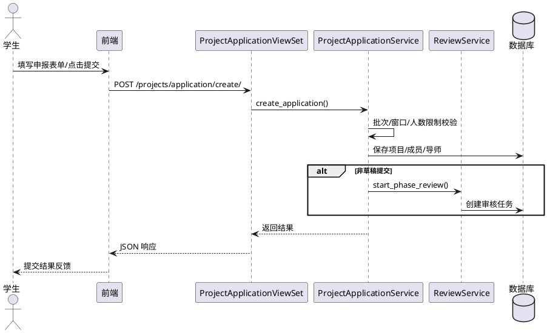

图6-2 审核评审时序图（PlantUML，占位）

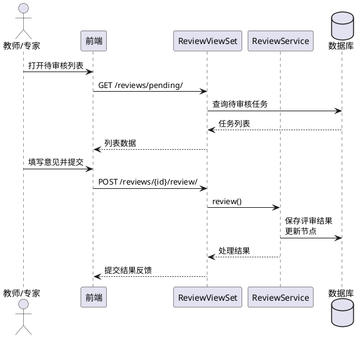

图6-3 结题申请与成果维护时序图（PlantUML，占位）

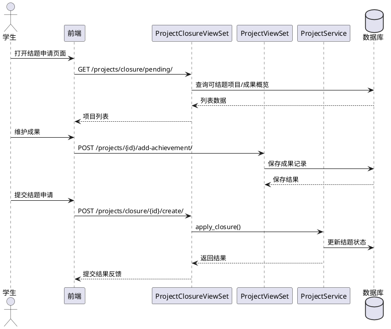

图6-4 经费支出审批时序图（PlantUML，占位）

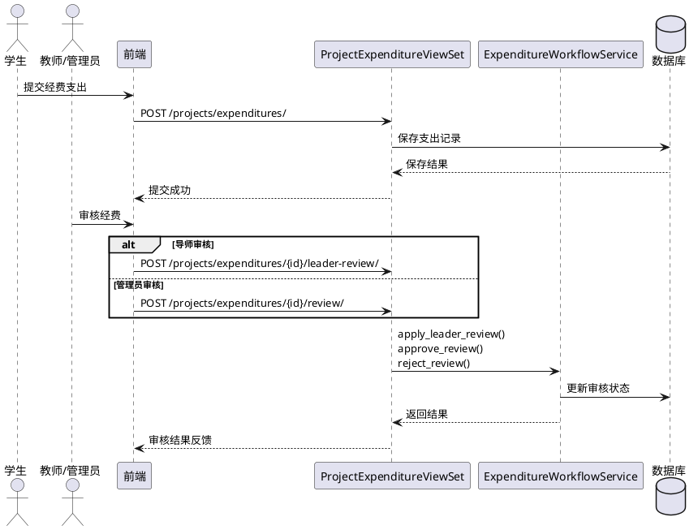

## 7. 系统测试

### 7.1 测试环境与方法

测试在本地开发环境完成，前端与后端分别以开发模式运行，数据库使用 PostgreSQL。浏览器采用 Chromium 系列进行页面验证。测试方法以黑盒功能测试为主，覆盖角色权限、流程流转与表单校验，并结合关键接口的状态与数据一致性检查。

### 7.2 核心功能测试

### 7.2.1 登录与权限

表7-1 登录与权限测试用例
| 编号 | 测试点 | 前置条件 | 输入/操作 | 期望结果 | 实际结果 |
| --- | --- | --- | --- | --- | --- |
| 7-1-1 | 正常登录 | 用户账号存在且启用 | 输入正确学号/工号与密码登录 | 登录成功，返回 JWT 并进入对应角色首页 | 通过 |
| 7-1-2 | 密码错误 | 用户账号存在 | 输入错误密码 | 提示登录失败，不返回令牌 | 通过 |
| 7-1-3 | 未登录访问受限页 | 无 | 直接访问受限路由 | 跳转登录页或提示未登录 | 通过 |
| 7-1-4 | 角色越权 | 学生账号已登录 | 访问管理员路由 | 被拒绝或跳转无权限提示 | 通过 |
| 7-1-5 | 登录后角色跳转 | 教师/管理员账号已登录 | 刷新或重新进入系统 | 自动跳转到对应工作台 | 通过 |

### 7.2.2 立项申报与流程流转

表7-2 立项申报与流程流转测试用例
| 编号 | 测试点 | 前置条件 | 输入/操作 | 期望结果 | 实际结果 |
| --- | --- | --- | --- | --- | --- |
| 7-2-1 | 立项草稿保存 | 学生账号已登录 | 填写申报表单后点击“保存草稿” | 草稿保存成功，草稿箱出现记录 | 通过 |
| 7-2-2 | 立项提交 | 学生账号已登录 | 完整填写表单并点击“提交” | 项目状态变为“已提交”，进入审核列表 | 通过 |
| 7-2-3 | 草稿编辑与再次提交 | 草稿箱存在记录 | 打开草稿修改后提交 | 草稿更新并完成提交 | 通过 |
| 7-2-4 | 导师审核 | 教师账号已登录，存在待审核项目 | 打开审核弹窗，填写意见并通过/驳回 | 审核结果记录成功，学生端状态更新 | 通过 |
| 7-2-5 | 管理员审核流转 | 管理员账号已登录 | 在“立项审核”列表执行通过/驳回 | 项目状态与流程节点按配置推进 | 通过 |

### 7.2.3 专家评审与评审意见

表7-3 专家评审与评审意见测试用例
| 编号 | 测试点 | 前置条件 | 输入/操作 | 期望结果 | 实际结果 |
| --- | --- | --- | --- | --- | --- |
| 7-3-1 | 专家组创建 | 管理员账号已登录 | 新建专家组并添加成员 | 专家组创建成功，成员列表保存 | 通过 |
| 7-3-2 | 评审任务分配 | 管理员账号已登录，存在待评审项目 | 选择项目并分配到专家组 | 评审任务生成，专家端可见 | 通过 |
| 7-3-3 | 专家提交评审意见 | 教师账号具备专家资格 | 在“评审任务”中填写意见并提交 | 评审记录保存，任务状态更新 | 通过 |
| 7-3-4 | 评审任务已完成 | 专家已提交意见 | 查看评审任务列表 | 已评审列表出现该记录 | 通过 |
| 7-3-5 | 管理员查看评审结果 | 管理员账号已登录 | 在审核详情查看评审意见 | 可查看汇总意见并继续终审 | 通过 |

### 7.2.4 经费支出与审批

表7-4 经费支出与审批测试用例
| 编号 | 测试点 | 前置条件 | 输入/操作 | 期望结果 | 实际结果 |
| --- | --- | --- | --- | --- | --- |
| 7-4-1 | 录入经费支出 | 学生账号已登录，项目处于可用状态 | 在经费页新增支出并上传凭证 | 支出记录创建成功，状态为待审核 | 通过 |
| 7-4-2 | 余额不足校验 | 学生账号已登录 | 填写超出剩余额度的金额提交 | 提示余额不足，记录未创建 | 通过 |
| 7-4-3 | 负责人预审 | 非负责人录入支出 | 负责人在列表中执行预审通过 | 支出进入工作流审核 | 通过 |
| 7-4-4 | 管理员审核 | 管理员账号已登录 | 在经费审核列表中通过/驳回 | 状态更新为通过/驳回并记录意见 | 通过 |
| 7-4-5 | 支出列表查询 | 学生账号已登录 | 在经费详情页筛选/分页 | 列表正常返回，统计面板同步更新 | 通过 |

### 7.2.5 中期检查与结题验收

表7-5 中期检查与结题验收测试用例
| 编号 | 测试点 | 前置条件 | 输入/操作 | 期望结果 | 实际结果 |
| --- | --- | --- | --- | --- | --- |
| 7-5-1 | 中期报告提交 | 学生账号已登录，项目处于进行中 | 上传中期报告并提交 | 中期提交成功，进入审核列表 | 通过 |
| 7-5-2 | 中期草稿保存 | 学生账号已登录 | 点击保存草稿 | 草稿保存成功，可在草稿箱查看 | 通过 |
| 7-5-3 | 中期删除提交 | 学生账号已登录 | 在中期报告页删除提交 | 记录进入回收站并可恢复 | 通过 |
| 7-5-4 | 结题申请提交 | 学生账号已登录，项目达到结题阶段 | 上传结题报告与成果清单并提交 | 结题申请成功，进入审核列表 | 通过 |
| 7-5-5 | 结题成果维护 | 学生账号已登录 | 新增/编辑/删除成果条目 | 成果列表更新，提交时同步保存 | 通过 |
| 7-5-6 | 结题审核 | 管理员账号已登录 | 在结题审核中通过/驳回 | 结题状态更新并回传意见 | 通过 |

### 7.2.6 字典/用户/通知管理

表7-6 字典/用户/通知管理测试用例
| 编号 | 测试点 | 前置条件 | 输入/操作 | 期望结果 | 实际结果 |
| --- | --- | --- | --- | --- | --- |
| 7-6-1 | 字典条目新增 | 校级管理员账号已登录 | 在系统参数中新增字典条目 | 条目创建成功，前端下拉可见 | 通过 |
| 7-6-2 | 字典批量导入与清空 | 校级管理员账号已登录 | 执行批量导入/清空操作 | 条目批量更新或清空成功 | 通过 |
| 7-6-3 | 用户创建与启停用 | 校级管理员账号已登录 | 新建用户并切换启停状态 | 用户可创建，状态切换生效 | 通过 |
| 7-6-4 | 专家资格设置 | 校级管理员账号已登录 | 勾选/取消专家资格 | 教师端出现/移除评审任务入口 | 通过 |
| 7-6-5 | 通知查询与已读 | 任意角色已登录 | 打开通知中心并标记已读 | 通知列表更新，未读数减少 | 通过 |
| 7-6-6 | 批量通知发送 | 管理员账号已登录 | 批量选择项目并发送通知 | 接收人通知中心收到消息 | 通过 |

### 7.3 测试结果与问题汇总

本次功能测试覆盖登录与权限、立项审核、专家评审、中期/结题、经费与基础管理等核心模块，整体功能正常，流程流转与角色权限控制符合预期。测试中仍发现少量需优化的交互与边界问题，后续可进一步完善：

- 部分页面在网络较慢时加载状态提示不够明显，需加强加载与空状态反馈。
- 个别表单在附件上传失败时提示信息不够明确，建议完善错误信息展示。
- 批量操作的反馈信息以弹窗为主，可增加操作完成后的结果列表或失败明细。

## 8. 部署与运行

### 8.1 本地部署与启动流程

系统由前端、后端与数据库三部分组成，默认端口为前端 `3000`、后端 `8000`。本地部署以“安装依赖—配置环境—启动服务—访问验证”为主线，具体步骤可参考 `docs/SETUP.md`。

表8-1 本地部署与启动流程
| 步骤 | 说明 |
| --- | --- |
| 环境准备 | 安装 Python、Node.js、PostgreSQL 等基础运行环境 |
| 后端配置 | 配置后端环境变量与数据库连接信息 |
| 后端启动 | 安装依赖后启动后端服务 |
| 前端配置 | 设置前端 API 地址并安装依赖 |
| 前端启动 | 启动前端开发服务并访问系统 |
| 访问验证 | 通过登录页进入系统并检查角色首页是否正常 |

### 8.2 运行配置与参数说明

系统运行配置分为“前端 API 地址、后端运行参数、数据库连接信息”三类。前端通过 `VITE_API_BASE_URL` 指定后端地址；后端通过 `.env` 文件读取运行参数；数据库连接信息集中在 `backend/config/settings.py`，用于确定数据库主机、端口与账号。

表8-2 关键运行参数说明
| 参数 | 作用范围 | 说明 | 默认/示例 |
| --- | --- | --- | --- |
| VITE_API_BASE_URL | 前端 | API 根地址（最终为 `/api/v1` 前缀） | `http://localhost:8000` |
| DJANGO_SECRET_KEY | 后端 | JWT 与会话签名密钥 | 建议配置随机长字符串 |
| DJANGO_MEDIA_ROOT | 后端 | 上传文件存储目录 | `.local/backend/media` |
| DJANGO_LOG_DIR | 后端 | 日志输出目录 | `.local/backend/logs` |
| DEFAULT_USER_PASSWORD | 后端 | 创建用户默认密码 | `123456` |
| DEFAULT_RESET_PASSWORD | 后端 | 重置密码默认值 | `123456` |
| DJANGO_SERVER_MODE | 后端 | 运行模式选择 | `gunicorn`/`runserver` |
| 数据库连接 | 后端 | 主机/端口/库名/账号/密码 | `localhost:5432` 等 |

## 9. 总结与展望

### 9.1 总结

本课程设计完成了《大学生创新创业管理系统》的需求分析、总体设计、数据库建模以及前后端实现与测试。系统以项目全生命周期为主线，学生端覆盖立项申报、中期检查、结题申请、经费录入与项目变更；教师/专家端提供待审核与评审任务处理；管理端提供项目库、审核管理、专家组与评审分配、统计概览、批次与工作流配置、字典与证书配置等功能，并通过角色与数据范围控制保证权限边界清晰。整体上达到了课程设计的实践目标，具备完整的业务闭环与可运行的系统原型，为后续扩展与部署奠定了基础。

### 9.2 展望

后续可从性能与功能完善两方面持续提升：一是对统计报表、批量导出与通知等高频功能进行性能优化，并改进批量操作的反馈信息；二是增强流程配置与统计分析能力，例如增加节点拖拽排序、配置版本对比与导入导出、报表维度扩展与导出模板定制。与此同时，可考虑与校内统一身份认证或教务系统对接，减少人工维护成本并提升数据一致性。

## 10. 参考文献

[1] 王某某. 软件工程导论[M]. 北京: 清华大学出版社, 2018.
[2] 侯某某. 数据库系统概论[M]. 北京: 高等教育出版社, 2015.
[3] Django Software Foundation. Django Documentation[EB/OL]. https://docs.djangoproject.com/, 2024-05-01.
[4] Vue.js Team. Vue.js Documentation[EB/OL]. https://vuejs.org/, 2024-05-01.
[5] PostgreSQL Global Development Group. PostgreSQL Documentation[EB/OL]. https://www.postgresql.org/docs/, 2024-05-01.
